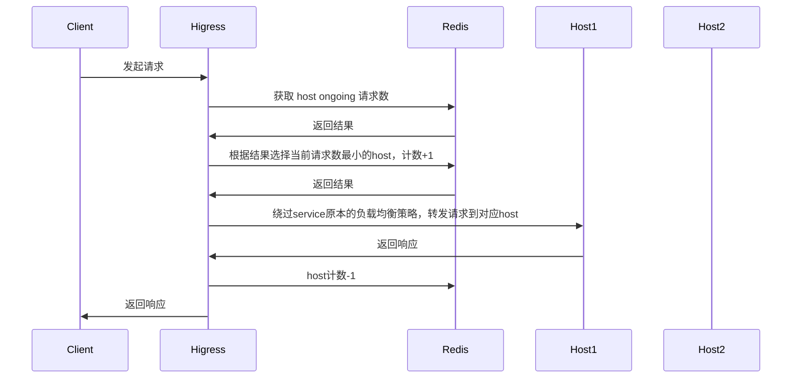
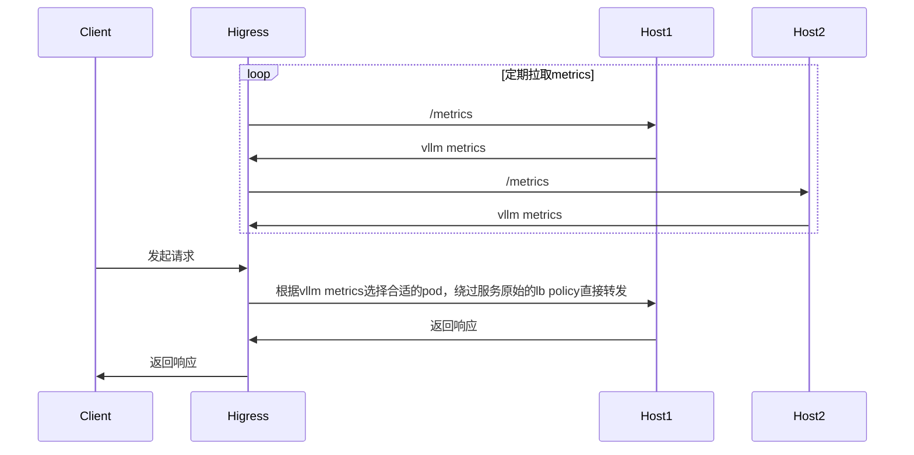
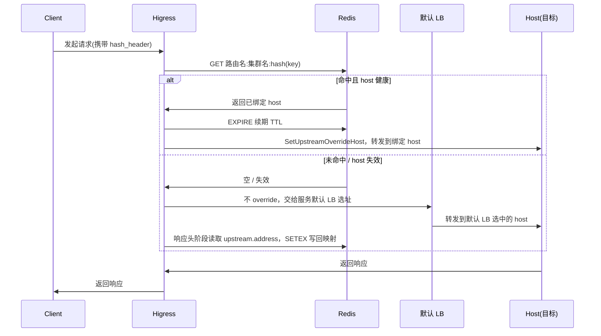

# 功能说明

**注意**：
- Higress网关版本需要>=v2.1.5

对LLM服务提供热插拔的负载均衡策略，如果关闭插件，负载均衡策略会退化为服务本身的负载均衡策略（轮训、本地最小请求数、随机、一致性hash等）。

配置如下：

| 名称                | 数据类型         | 填写要求          | 默认值       | 描述                                 |
|--------------------|-----------------|------------------|-------------|-------------------------------------|
| `lb_type`        | string          | 选填              | endpoint    | 负载均衡类型，可选`endpoint`,`cluster` |
| `lb_policy`      | string          | 必填              |             | 负载均衡策略类型    |
| `lb_config`      | object          | 必填              |             | 当前负载均衡策略类型的配置    |

`lb_type` 为 `endpoint` 时支持的负载均衡策略包括：

- `global_least_request`: 基于redis实现的全局最小请求数负载均衡
- `prefix_cache`: 基于 prompt 前缀匹配选择后端节点，如果通过前缀匹配无法匹配到节点，则通过全局最小请求数进行服务节点的选择
- `endpoint_metrics`: 基于 llm 服务暴露的 metrics 进行负载均衡
- `endpoint_hash`: 基于 Redis 的有状态会话保持。读取指定请求头作为 key，将相同 key 的请求始终路由到同一个后端节点（host）；首次出现的 key 由服务自身默认 LB 选址并记录，后续请求复用；当请求缺少该 key 时，退化为服务自身的默认负载均衡策略

`lb_type` 为 `cluster` 时支持的负载均衡策略包括：
- `cluster_metrics`: 基于网关统计的不同service的指标进行服务之间的负载均衡
- `cluster_hash`: 读取指定请求头做 FNV-1a 一致性 hash，将相同 key 的请求始终路由到同一 cluster，支持按权重分配流量
# 全局最小请求数
## 功能说明



## 配置说明

| 名称                | 数据类型         | 填写要求          | 默认值       | 描述                                 |
|--------------------|-----------------|------------------|-------------|-------------------------------------|
| `serviceFQDN`      | string          | 必填              |             | redis 服务的FQDN，例如: `redis.dns`    |
| `servicePort`      | int             | 必填              |             | redis 服务的port                      |
| `username`         | string          | 必填              |             | redis 用户名                         |
| `password`         | string          | 选填              | 空          | redis 密码                           |
| `timeout`          | int             | 选填              | 3000ms      | redis 请求超时时间                    |
| `database`         | int             | 选填              | 0           | redis 数据库序号                      |

## 配置示例

```yaml
lb_type: endpoint
lb_policy: global_least_request
lb_config:
  serviceFQDN: redis.static
  servicePort: 6379
  username: default
  password: '123456'
```

# 前缀匹配
## 功能说明
根据 prompt 前缀匹配选择 pod，以复用 KV Cache，如果通过前缀匹配无法匹配到节点，则通过全局最小请求数进行服务节点的选择

例如以下请求被路由到了pod 1

```json
{
  "model": "qwen-turbo",
  "messages": [
    {
      "role": "user",
      "content": "hi"
    }
  ]
}
```

那么后续具有相同前缀的请求也会被路由到 pod 1
```json
{
  "model": "qwen-turbo",
  "messages": [
    {
      "role": "user",
      "content": "hi"
    },
    {
      "role": "assistant",
      "content": "Hi! How can I assist you today? 😊"
    },
    {
      "role": "user",
      "content": "write a short story aboud 100 words"
    }
  ]
}
```

## 配置说明

| 名称                | 数据类型         | 填写要求          | 默认值       | 描述                                 |
|--------------------|-----------------|------------------|-------------|-------------------------------------|
| `serviceFQDN`      | string          | 必填              |             | redis 服务的FQDN，例如: `redis.dns`    |
| `servicePort`      | int             | 必填              |             | redis 服务的port                      |
| `username`         | string          | 必填              |             | redis 用户名                         |
| `password`         | string          | 选填              | 空          | redis 密码                           |
| `timeout`          | int             | 选填              | 3000ms      | redis 请求超时时间                    |
| `database`         | int             | 选填              | 0           | redis 数据库序号                      |
| `redisKeyTTL`      | int             | 选填              | 1800s      | prompt 前缀对应的key的ttl             |

## 配置示例

```yaml
lb_type: endpoint
lb_policy: prefix_cache
lb_config:
  serviceFQDN: redis.static
  servicePort: 6379
  username: default
  password: '123456'
```

# 最小负载
## 功能说明
[gateway-api-inference-extension](https://github.com/kubernetes-sigs/gateway-api-inference-extension/blob/main/README.md) 的 wasm 实现



<!-- pod选取流程图如下：

 -->

## 配置说明

| 名称                | 数据类型         | 填写要求          | 默认值       | 描述                                 |
|--------------------|-----------------|------------------|-------------|-------------------------------------|
| `metric_policy`      | string | 必填 | | 如何使用llm暴露的metrics做负载均衡，当前支持`[default, least, most]` |
| `target_metric`      | string | 选填 | | 要使用的metric名称，`metric_policy` 取值为 `least` 或者 `most` 时生效 |
| `rate_limit`      | string | 选填 | 1 | 单个节点处理请求比例上限，取值范围0~1 |


## 配置示例

使用 [gateway-api-inference-extension](https://github.com/kubernetes-sigs/gateway-api-inference-extension/blob/main/README.md) 中的算法

```yaml
lb_type: endpoint
lb_policy: metrics_based
lb_config:
  metric_policy: default
  rate_limit: 0.6 # 单个节点承载的最大请求比例
```

根据当前排队请求数进行负载均衡

```yaml
lb_type: endpoint
lb_policy: metrics_based
lb_config:
  metric_policy: least
  target_metric: vllm:num_requests_waiting
  rate_limit: 0.6 # 单个节点承载的最大请求比例
```

根据当前GPU中正在处理的请求数进行负载均衡

```yaml
lb_type: endpoint
lb_policy: metrics_based
lb_config:
  metric_policy: least
  target_metric: vllm:num_requests_running
  rate_limit: 0.6 # 单个节点承载的最大请求比例
```


# 跨服务负载均衡

## 配置说明

| 名称                | 数据类型         | 填写要求          | 默认值       | 描述                                 |
|--------------------|-----------------|------------------|-------------|-------------------------------------|
| `mode`      | string | 必填 | | 如何使用服务级指标做负载均衡，当前支持`[LeastBusy, LeastTotalLatency, LeastFirstTokenLatency ]` |
| `service_list`      | []string | 必填 | | 路由后端服务列表 |
| `rate_limit`      | string | 选填 | 1 | 单个服务处理请求比例上限，取值范围0~1 |
| `cluster_header` | string | 选填 | `x-higress-target-cluster` | 通过取该header的值得知需要路由到哪个后端服务 |
| `queue_size`      | int | 选填 | 100 | 根据最近的多少个请求进行观测指标的计算 |

`mode` 各取值含义如下：
- `LeastBusy`: 路由到当前并发请求数最少的服务
- `LeastTotalLatency`: 路由到当前RT最低的服务
- `LeastFirstTokenLatency`: 路由到当前首包RT最低的服务

## 配置示例

```yaml
lb_type: cluster
lb_policy: cluster_metrics
lb_config:
  mode: LeastTotalLatency # 策略名称
  queue_size: 100 # 统计指标时使用的最近请求数
  rate_limit: 0.6 # 单个服务承载的最大请求比例
  service_list:
  - outbound|80||test-1.dns
  - outbound|80||test-2.static
```

# Endpoint Hash（基于 Redis 的有状态会话保持）

## 功能说明

读取指定请求头的值作为 key，把相同 key 的请求**粘性**路由到同一个后端节点（host），实现会话保持。映射关系保存在 Redis 中，跨网关实例共享、重启不丢失。

选址顺序：

1. 请求**缺少** `hash_header` 指定的请求头 → 不介入选址，直接走服务自身默认 LB，不记录状态。
2. key 存在 → 用 FNV-1a 对 key 做 hash，按 `路由名:集群名:hash` 作为 Redis key 查询：
   - **命中**且记录的 host 仍健康 → `SetUpstreamOverrideHost` 固定到该 host，并刷新 TTL。
   - **未命中**（首次出现）或记录的 host 已不健康 → 不 override，让**服务自身默认 LB**选址；在响应阶段读取实际选中的 host（`upstream.address`），写回 Redis 供后续请求复用。

与 `cluster_hash` 的区别：
- `endpoint_hash` 作用在 **endpoint 级**，通过 `SetUpstreamOverrideHost` 在已选定的 cluster 内部固定 host（机制与 `global_least_request` 一致），无需配合 EnvoyFilter。
- **有状态**：首次选址由默认 LB（如 least-request）决定，兼顾负载均衡；之后稳定粘住，且记录写入 Redis 后**不随扩缩容迁移**（除非该 host 不健康才重新选址）。
- Redis 不可用 / 缺 header / 无健康节点时，均**优雅退化**为服务自身默认 LB，不拒绝请求。



## 配置说明

| 名称 | 数据类型 | 填写要求 | 默认值 | 描述 |
|------|----------|----------|--------|------|
| `hash_header` | string | 选填 | `x-mse-consumer` | 读取 hash key 的请求头名称 |
| `stickyTimeout` | int | 选填 | `60` | 粘性映射的过期时间（分钟），命中时自动续期 |
| `serviceFQDN` | string | 必填 | - | Redis 服务的 FQDN |
| `servicePort` | int | 必填 | - | Redis 服务端口 |
| `username` | string | 选填 | - | Redis 用户名（Redis 6+ ACL 一般为 `default`） |
| `password` | string | 选填 | - | Redis 密码。**若 Redis 开启鉴权必须填写**，否则每次读写都会 `NOAUTH` 失败，导致粘性完全不生效 |
| `timeout` | int | 选填 | `3000` | Redis 操作超时（毫秒） |
| `database` | int | 选填 | `0` | Redis database 编号 |

## 配置示例

```yaml
lb_type: endpoint
lb_policy: endpoint_hash
lb_config:
  hash_header: x-mse-consumer
  stickyTimeout: 60
  serviceFQDN: redis.dns
  servicePort: 6379
  username: default
  password: "123456"
  timeout: 3000
  database: 0
```

> 当请求不含 `hash_header` 指定的请求头时，本策略不介入选址，请求按服务原本的负载均衡策略转发。

# Cluster Hash（一致性 Hash 路由）

## 功能说明

读取指定请求头的值，使用 FNV-1a 一致性 hash 算法将请求路由到固定的上游集群，确保相同 hash key 的请求始终落到同一个 cluster，同时支持按百分比权重控制各 cluster 的流量分配。

需要配合 EnvoyFilter 的 `cluster_header` 机制一起使用。

## 配置说明

| 名称 | 数据类型 | 填写要求 | 默认值 | 描述 |
|------|----------|----------|--------|------|
| `clusters` | []ClusterEntry | 必填 | - | cluster 列表，所有 `weight` 之和必须为 100 |
| `hash_header` | string | 选填 | `x-mse-consumer` | 读取 hash key 的请求头名称 |
| `cluster_header` | string | 选填 | `x-higress-target-cluster` | 写入目标 cluster 的请求头名称 |

### ClusterEntry 字段

| 名称 | 类型 | 必填 | 说明 |
|------|------|------|------|
| `cluster` | string | 是 | 上游集群名称，如 `outbound|443||llm-xxx.internal.static` |
| `weight` | int | 是 | 百分比权重，所有 cluster 的 weight 之和必须为 100 |

## 配置示例

```yaml
lb_type: cluster
lb_policy: cluster_hash
lb_config:
  clusters:
    - cluster: "outbound|80||llm-test1.internal.static"
      weight: 69
    - cluster: "outbound|443||llm-test2.internal.dns"
      weight: 30
    - cluster: "outbound|443||llm-test3.internal.dns"
      weight: 1
  hash_header: x-mse-consumer
  cluster_header: x-higress-target-cluster
```

若请求缺少 hash header，插件直接返回 **403**。