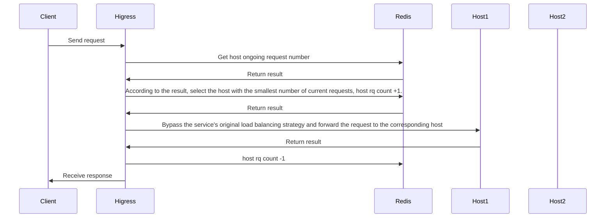
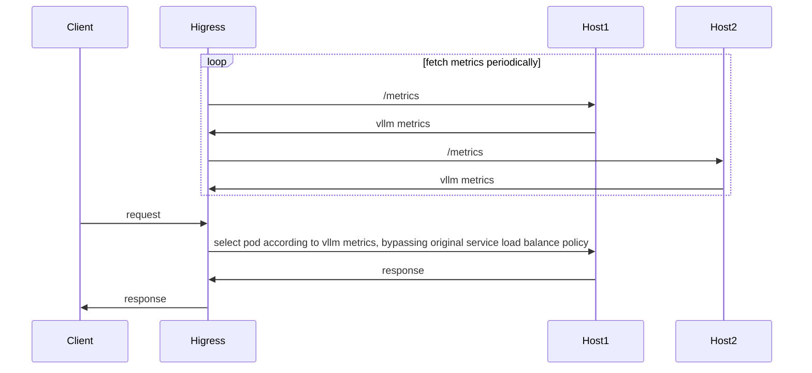
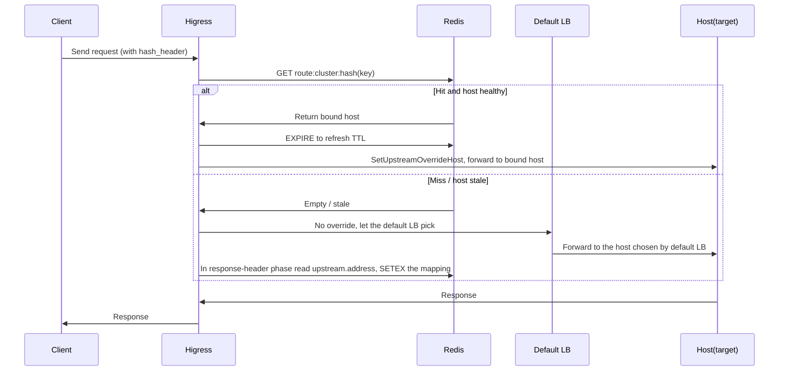

# Introduction

**Attention**: 
- Version of Higress should >= v2.1.5

This plug-in provides the llm-oriented load balancing capability in a hot-swappable manner. If the plugin is closed, the load balancing strategy will degenerate into the load balancing strategy of the service itself (round robin, local minimum request number, random, consistent hash, etc.).

The configuration is:

| Name                | Type         | Required          | default       | description                                 |
|--------------------|-----------------|------------------|-------------|-------------------------------------|
| `lb_type`        | string          | optional              | endpoint    | load balance policy type, `endpoint` or `cluster` |
| `lb_policy`      | string          | required              |             | load balance policy type    |
| `lb_config`      | object          | required              |             | configuration for the current load balance type    |

When `lb_type = endpoint`, current supported load balance policies are:

- `global_least_request`: global least request based on redis
- `prefix_cache`: Select the backend node based on the prompt prefix match. If the node cannot be matched by prefix matching, the service node is selected based on the global minimum number of requests.
- `endpoint_metrics`: Load balancing based on metrics exposed by the llm service
- `endpoint_hash`: Redis-backed stateful session affinity. Reads a specified request header as the key and sticks requests with the same key to the same backend host (endpoint). The first time a key is seen, the host is chosen by the service's own default LB and recorded; subsequent requests reuse it. When the key is absent, it degrades to the service's own default load balancing policy.

When `lb_type = cluster`, current supported load balance policies are:
- `cluster_metrics`: Load balancing based on metrics of clusters
- `cluster_hash`: Consistent hash routing based on a request header value, always routing the same hash key to the same cluster, with weighted traffic distribution


# Global Least Request
## Introduction



## Configuration

| Name                | Type         | required          | default       | description                                 |
|--------------------|-----------------|------------------|-------------|-------------------------------------|
| `serviceFQDN`      | string          | required              |             | redis FQDN, e.g.  `redis.dns`    |
| `servicePort`      | int             | required              |             | redis port                      |
| `username`         | string          | required              |             | redis username                         |
| `password`         | string          | optional              | ``          | redis password                           |
| `timeout`          | int             | optional              | 3000ms      | redis request timeout                    |
| `database`         | int             | optional              | 0           | redis database number                      |

## Configuration Example

```yaml
lb_type: endpoint
lb_policy: global_least_request
lb_config:
  serviceFQDN: redis.static
  servicePort: 6379
  username: default
  password: '123456'
```

# Prefix Cache
## Introduction
Select pods based on the prompt prefix match to reuse KV Cache. If no node can be matched by prefix match, select the service node based on the global minimum number of requests.

For example, the following request is routed to pod 1:

```json
{
  "model": "qwen-turbo",
  "messages": [
    {
      "role": "user",
      "content": "hi"
    }
  ]
}
```

Then subsequent requests with the same prefix will also be routed to pod 1:

```json
{
  "model": "qwen-turbo",
  "messages": [
    {
      "role": "user",
      "content": "hi"
    },
    {
      "role": "assistant",
      "content": "Hi! How can I assist you today? 😊"
    },
    {
      "role": "user",
      "content": "write a short story aboud 100 words"
    }
  ]
}
```

## Configuration

| Name               | Type            | required              | default     | description                     |
|--------------------|-----------------|-----------------------|-------------|---------------------------------|
| `serviceFQDN`      | string          | required              |             | redis FQDN, e.g.  `redis.dns`   |
| `servicePort`      | int             | required              |             | redis port                      |
| `username`         | string          | required              |             | redis username                  |
| `password`         | string          | optional              | ``          | redis password                  |
| `timeout`          | int             | optional              | 3000ms      | redis request timeout           |
| `database`         | int             | optional              | 0           | redis database number           |
| `redisKeyTTL`      | int             | optional              | 1800s      | prompt prefix key's ttl         |

## Configuration Example

```yaml
lb_type: endpoint
lb_policy: prefix_cache
lb_config:
  serviceFQDN: redis.static
  servicePort: 6379
  username: default
  password: '123456'
```

# Least Busy
## Introduction

wasm implementation for [gateway-api-inference-extension](https://github.com/kubernetes-sigs/gateway-api-inference-extension/blob/main/README.md)



<!-- flowchart for pod selection:

 -->

## Configuration

| Name                | Type         | Required          | default       | description                                 |
|--------------------|-----------------|------------------|-------------|-------------------------------------|
| `metric_policy`      | string | required | | How to use the metrics exposed by LLM for load balancing, currently supporting `[default, least, most]` |
| `target_metric`      | string | optional | | The metric name to use. This is valid only when `metric_policy` is `least` or `most` |
| `rate_limit`      | string | optional | 1 | The maximum percentage of requests a single node can receive, 0~1 |

## Configuration Example

Use the algorithm of [gateway-api-inference-extension](https://github.com/kubernetes-sigs/gateway-api-inference-extension/blob/main/README.md):

```yaml
lb_type: endpoint
lb_policy: metrics_based
lb_config:
  metric_policy: default
  rate_limit: 0.6
```

Load balancing based on the current number of queued requests: 

```yaml
lb_type: endpoint
lb_policy: metrics_based
lb_config:
  metric_policy: least
  target_metric: vllm:num_requests_waiting
  rate_limit: 0.6
```

Load balancing based on the number of requests currently being processed by the GPU:

```yaml
lb_type: endpoint
lb_policy: metrics_based
lb_config:
  metric_policy: least
  target_metric: vllm:num_requests_running
  rate_limit: 0.6
```

# Cross-service load balancing

## Configuration

| 名称                | 数据类型         | 填写要求          | 默认值       | 描述                                 |
|--------------------|-----------------|------------------|-------------|-------------------------------------|
| `mode`      | string | required | | how to use cluster metrics, value of `[LeastBusy, LeastTotalLatency, LeastFirstTokenLatency ]` |
| `service_list`      | []string | required | | service list of current route |
| `rate_limit`      | string | optional | 1 | The maximum percentage of requests a single node can receive, value of 0~1 |
| `cluster_header` | string | optional | `x-higress-target-cluster` | By retrieving the value of this header, we can determine which backend service to route to |
| `queue_size`      | int | optional | 100 | The metrics is calculated based on the number of most recent requests. |

The meanings of the values ​​for `mode` are as follows:

- `LeastBusy`: Routes to the service with the fewest concurrent requests.
- `LeastTotalLatency`: Routes to the service with the lowest response time (RT).
- `LeastFirstTokenLatency`: Routes to the service with the lowest RT for the first packet.

## Configuration Example

```yaml
lb_type: cluster
lb_policy: cluster_metrics
lb_config:
  mode: LeastTotalLatency
  rate_limit: 0.6
  service_list:
  - outbound|80||test-1.dns
  - outbound|80||test-2.static
```

# Cluster Hash

## Introduction

Reads a specified request header value and uses FNV-1a consistent hashing to route requests to a fixed upstream cluster. The same hash key always maps to the same cluster, while weighted distribution controls traffic allocation across clusters.

Requires EnvoyFilter `cluster_header` mechanism to be enabled.

## Configuration

| Name | Type | Required | Default | Description |
|------|------|----------|---------|-------------|
| `clusters` | []ClusterEntry | required | - | Cluster list. Sum of all `weight` values must be 100 |
| `hash_header` | string | optional | `x-mse-consumer` | Request header name to read the hash key from |
| `cluster_header` | string | optional | `x-higress-target-cluster` | Request header name to write the selected cluster into |

### ClusterEntry Fields

| Name | Type | Required | Description |
|------|------|----------|-------------|
| `cluster` | string | yes | Upstream cluster name, e.g. `outbound\|443\|\|llm-xxx.internal.static` |
| `weight` | int | yes | Percentage weight. Sum of all cluster weights must be 100 |

## Configuration Example

```yaml
lb_type: cluster
lb_policy: cluster_hash
lb_config:
  clusters:
    - cluster: "outbound|80||llm-test1.internal.static"
      weight: 69
    - cluster: "outbound|443||llm-test2.internal.dns"
      weight: 30
    - cluster: "outbound|443||llm-test3.internal.dns"
      weight: 1
  hash_header: x-mse-consumer
  cluster_header: x-higress-target-cluster
```

If the request is missing the hash header, the plugin returns **403** directly.

# Endpoint Hash (Redis-backed Stateful Session Affinity)

## Introduction

Reads a specified request header value as the key and **sticks** requests with the same key to the same backend host (endpoint) to achieve session affinity. The mapping is stored in Redis, so it is shared across gateway instances and survives restarts.

Selection order:

1. The request is **missing** the header named by `hash_header` → no override, use the service's own default LB, record nothing.
2. The key exists → FNV-1a hash it and look it up in Redis under `route:cluster:hash`:
   - **Hit** and the recorded host is still healthy → `SetUpstreamOverrideHost` pins the request to that host and refreshes the TTL.
   - **Miss** (first time) or the recorded host is no longer healthy → do not override, let the service's **own default LB** pick a host; in the response-header phase read the actually selected host (`upstream.address`) and write it back to Redis for reuse.

Differences from `cluster_hash`:
- `endpoint_hash` works at the **endpoint level** via `SetUpstreamOverrideHost`, pinning a host inside the already-selected cluster (same mechanism as `global_least_request`); no EnvoyFilter required.
- **Stateful**: the first selection is made by the default LB (e.g. least-request) for load balancing, then it sticks; once written to Redis the mapping **does not migrate on scaling** (unless the host becomes unhealthy and is re-picked).
- When Redis is unavailable / the header is missing / there is no healthy host, it **gracefully degrades** to the service's own default LB rather than rejecting the request.



## Configuration

| Name | Type | Required | Default | Description |
|------|------|----------|---------|-------------|
| `hash_header` | string | optional | `x-mse-consumer` | Request header name to read the hash key from |
| `stickyTimeout` | int | optional | `60` | TTL of a sticky mapping (minutes); auto-refreshed on hit |
| `serviceFQDN` | string | required | - | Redis service FQDN |
| `servicePort` | int | required | - | Redis service port |
| `username` | string | optional | - | Redis username (usually `default` for Redis 6+ ACL) |
| `password` | string | optional | - | Redis password. **Required if Redis auth is enabled**, otherwise every read/write fails with `NOAUTH` and stickiness never works |
| `timeout` | int | optional | `3000` | Redis operation timeout (ms) |
| `database` | int | optional | `0` | Redis database number |

## Configuration Example

```yaml
lb_type: endpoint
lb_policy: endpoint_hash
lb_config:
  hash_header: x-mse-consumer
  stickyTimeout: 60
  serviceFQDN: redis.dns
  servicePort: 6379
  username: default
  password: "123456"
  timeout: 3000
  database: 0
```

> When the request does not carry the header named by `hash_header`, this policy does not intervene and the request is forwarded by the service's original load balancing policy.