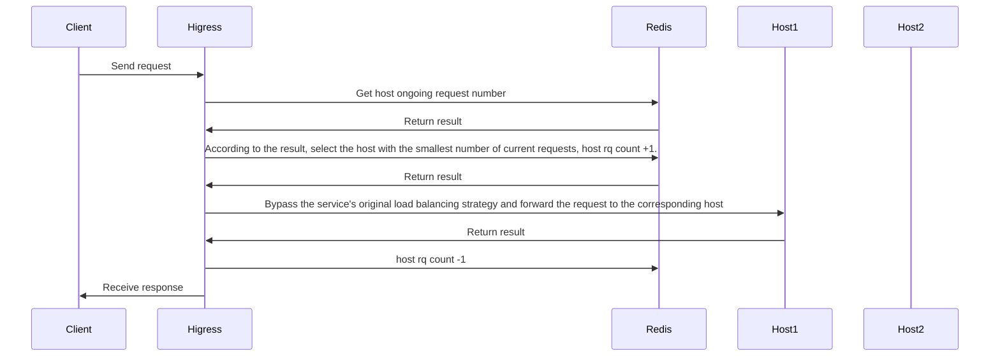
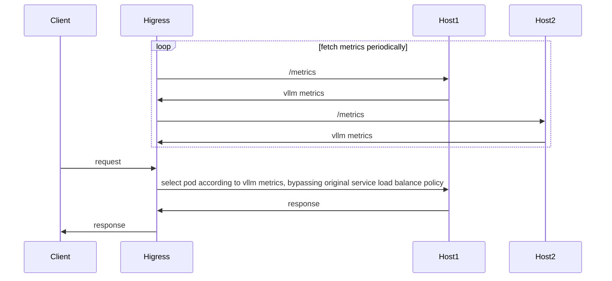

# Introduction

**Attention**: 
- Version of Higress should >= v2.1.5

This plug-in provides the llm-oriented load balancing capability in a hot-swappable manner. If the plugin is closed, the load balancing strategy will degenerate into the load balancing strategy of the service itself (round robin, local minimum request number, random, consistent hash, etc.).

The configuration is:

| Name                | Type         | Required          | default       | description                                 |
|--------------------|-----------------|------------------|-------------|-------------------------------------|
| `lb_type`        | string          | optional              | endpoint    | load balance policy type, `endpoint` or `cluster` |
| `lb_policy`      | string          | required              |             | load balance policy type    |
| `lb_config`      | object          | required              |             | configuration for the current load balance type    |

When `lb_type = endpoint`, current supported load balance policies are:

- `global_least_request`: global least request based on redis
- `prefix_cache`: Select the backend node based on the prompt prefix match. If the node cannot be matched by prefix matching, the service node is selected based on the global minimum number of requests.
- `endpoint_metrics`: Load balancing based on metrics exposed by the llm service

When `lb_type = cluster`, current supported load balance policies are:
- `cluster_metrics`: Load balancing based on metrics of clusters
- `cluster_hash`: Consistent hash routing based on a request header value, always routing the same hash key to the same cluster, with weighted traffic distribution


# Global Least Request
## Introduction



## Configuration

| Name                | Type         | required          | default       | description                                 |
|--------------------|-----------------|------------------|-------------|-------------------------------------|
| `serviceFQDN`      | string          | required              |             | redis FQDN, e.g.  `redis.dns`    |
| `servicePort`      | int             | required              |             | redis port                      |
| `username`         | string          | required              |             | redis username                         |
| `password`         | string          | optional              | ``          | redis password                           |
| `timeout`          | int             | optional              | 3000ms      | redis request timeout                    |
| `database`         | int             | optional              | 0           | redis database number                      |

## Configuration Example

```yaml
lb_type: endpoint
lb_policy: global_least_request
lb_config:
  serviceFQDN: redis.static
  servicePort: 6379
  username: default
  password: '123456'
```

# Prefix Cache
## Introduction
Select pods based on the prompt prefix match to reuse KV Cache. If no node can be matched by prefix match, select the service node based on the global minimum number of requests.

For example, the following request is routed to pod 1:

```json
{
  "model": "qwen-turbo",
  "messages": [
    {
      "role": "user",
      "content": "hi"
    }
  ]
}
```

Then subsequent requests with the same prefix will also be routed to pod 1:

```json
{
  "model": "qwen-turbo",
  "messages": [
    {
      "role": "user",
      "content": "hi"
    },
    {
      "role": "assistant",
      "content": "Hi! How can I assist you today? 😊"
    },
    {
      "role": "user",
      "content": "write a short story aboud 100 words"
    }
  ]
}
```

## Configuration

| Name               | Type            | required              | default     | description                     |
|--------------------|-----------------|-----------------------|-------------|---------------------------------|
| `serviceFQDN`      | string          | required              |             | redis FQDN, e.g.  `redis.dns`   |
| `servicePort`      | int             | required              |             | redis port                      |
| `username`         | string          | required              |             | redis username                  |
| `password`         | string          | optional              | ``          | redis password                  |
| `timeout`          | int             | optional              | 3000ms      | redis request timeout           |
| `database`         | int             | optional              | 0           | redis database number           |
| `redisKeyTTL`      | int             | optional              | 1800s      | prompt prefix key's ttl         |

## Configuration Example

```yaml
lb_type: endpoint
lb_policy: prefix_cache
lb_config:
  serviceFQDN: redis.static
  servicePort: 6379
  username: default
  password: '123456'
```

# Least Busy
## Introduction

wasm implementation for [gateway-api-inference-extension](https://github.com/kubernetes-sigs/gateway-api-inference-extension/blob/main/README.md)



<!-- flowchart for pod selection:

 -->

## Configuration

| Name                | Type         | Required          | default       | description                                 |
|--------------------|-----------------|------------------|-------------|-------------------------------------|
| `metric_policy`      | string | required | | How to use the metrics exposed by LLM for load balancing, currently supporting `[default, least, most]` |
| `target_metric`      | string | optional | | The metric name to use. This is valid only when `metric_policy` is `least` or `most` |
| `rate_limit`      | string | optional | 1 | The maximum percentage of requests a single node can receive, 0~1 |

## Configuration Example

Use the algorithm of [gateway-api-inference-extension](https://github.com/kubernetes-sigs/gateway-api-inference-extension/blob/main/README.md):

```yaml
lb_type: endpoint
lb_policy: metrics_based
lb_config:
  metric_policy: default
  rate_limit: 0.6
```

Load balancing based on the current number of queued requests: 

```yaml
lb_type: endpoint
lb_policy: metrics_based
lb_config:
  metric_policy: least
  target_metric: vllm:num_requests_waiting
  rate_limit: 0.6
```

Load balancing based on the number of requests currently being processed by the GPU:

```yaml
lb_type: endpoint
lb_policy: metrics_based
lb_config:
  metric_policy: least
  target_metric: vllm:num_requests_running
  rate_limit: 0.6
```

# Cross-service load balancing

## Configuration

| 名称                | 数据类型         | 填写要求          | 默认值       | 描述                                 |
|--------------------|-----------------|------------------|-------------|-------------------------------------|
| `mode`      | string | required | | how to use cluster metrics, value of `[LeastBusy, LeastTotalLatency, LeastFirstTokenLatency, AdaptiveScore]` |
| `service_list`      | []string | required | | service list of current route |
| `rate_limit`      | string | optional | 1 | The maximum percentage of requests a single node can receive, value of 0~1 |
| `cluster_header` | string | optional | `x-higress-target-cluster` | By retrieving the value of this header, we can determine which backend service to route to |
| `queue_size`      | int | optional | 100 | The metrics is calculated based on the number of most recent requests. |
| `ewma_beta` | float | optional | 0.5 | Historical EWMA weight used by `AdaptiveScore`, value of 0~1 |
| `p2c_choices` | int | optional | 2 | Number of sampled services compared by `AdaptiveScore`; compares all services when the value is not less than the service count |
| `ttft_weight` | float | optional | 0.7 | First-token latency weight used by `AdaptiveScore` |
| `total_latency_weight` | float | optional | 0.3 | Total response latency weight used by `AdaptiveScore` |
| `error_penalty` | float | optional | 3.0 | Recent error-rate penalty used by `AdaptiveScore` |
| `failure_cooldown_ms` | int | optional | 30000 | Cooldown duration after a failed request in `AdaptiveScore` |
| `metrics_missing_policy` | string | optional | `least_busy` | Fallback policy when `AdaptiveScore` has no latency samples, defaulting to current in-flight requests |
| `global_inflight_enabled` | bool | optional | false | Whether `AdaptiveScore` uses Redis to track global in-flight requests across gateway instances |
| `serviceFQDN` | string | required when `global_inflight_enabled=true` | | Redis service FQDN |
| `servicePort` | int | required when `global_inflight_enabled=true` | | Redis service port |
| `username` | string | optional | | Redis username |
| `password` | string | optional | empty | Redis password |
| `database` | int | optional | 0 | Redis database number |
| `global_inflight_key_prefix` | string | optional | `higress:adaptive_score_inflight` | Redis key prefix for global in-flight counters. The actual key also includes route and mode |
| `global_inflight_timeout` | int | optional | 3000 | Redis request timeout in milliseconds |
| `global_inflight_key_ttl` | int | optional | 1800 | TTL for global in-flight Redis keys in seconds |

The meanings of the values ​​for `mode` are as follows:

- `LeastBusy`: Routes to the service with the fewest concurrent requests.
- `LeastTotalLatency`: Routes to the service with the lowest response time (RT).
- `LeastFirstTokenLatency`: Routes to the service with the lowest RT for the first packet.
- `AdaptiveScore`: Combines EWMA first-token latency, EWMA total latency, current in-flight requests, and error rate into a score, then routes to the lowest-score service. It is designed for LLM backends whose latency and load fluctuate continuously.

When `global_inflight_enabled` is enabled, `AdaptiveScore` uses Redis Lua to atomically select the service with the lowest score after applying global in-flight pressure, then increments the selected service counter by 1. The counter is decremented when the request stream completes. If Redis initialization, dispatch, or response handling fails, the plugin falls back to local `AdaptiveScore` without blocking the request.

## Configuration Example

```yaml
lb_type: cluster
lb_policy: cluster_metrics
lb_config:
  mode: AdaptiveScore
  rate_limit: 0.6
  ewma_beta: 0.5
  p2c_choices: 2
  ttft_weight: 0.7
  total_latency_weight: 0.3
  error_penalty: 3.0
  failure_cooldown_ms: 30000
  global_inflight_enabled: true
  serviceFQDN: redis.static
  servicePort: 6379
  username: default
  password: ""
  database: 0
  global_inflight_key_prefix: higress:adaptive_score_inflight
  global_inflight_timeout: 3000
  global_inflight_key_ttl: 1800
  service_list:
  - outbound|80||test-1.dns
  - outbound|80||test-2.static
```

# Cluster Hash

## Introduction

Reads a specified request header value and uses FNV-1a consistent hashing to route requests to a fixed upstream cluster. The same hash key always maps to the same cluster, while weighted distribution controls traffic allocation across clusters.

Requires EnvoyFilter `cluster_header` mechanism to be enabled.

## Configuration

| Name | Type | Required | Default | Description |
|------|------|----------|---------|-------------|
| `clusters` | []ClusterEntry | required | - | Cluster list. Sum of all `weight` values must be 100 |
| `hash_header` | string | optional | `x-mse-consumer` | Request header name to read the hash key from |
| `cluster_header` | string | optional | `x-higress-target-cluster` | Request header name to write the selected cluster into |

### ClusterEntry Fields

| Name | Type | Required | Description |
|------|------|----------|-------------|
| `cluster` | string | yes | Upstream cluster name, e.g. `outbound\|443\|\|llm-xxx.internal.static` |
| `weight` | int | yes | Percentage weight. Sum of all cluster weights must be 100 |

## Configuration Example

```yaml
lb_type: cluster
lb_policy: cluster_hash
lb_config:
  clusters:
    - cluster: "outbound|80||llm-test1.internal.static"
      weight: 69
    - cluster: "outbound|443||llm-test2.internal.dns"
      weight: 30
    - cluster: "outbound|443||llm-test3.internal.dns"
      weight: 1
  hash_header: x-mse-consumer
  cluster_header: x-higress-target-cluster
```

If the request is missing the hash header, the plugin returns **403** directly.
